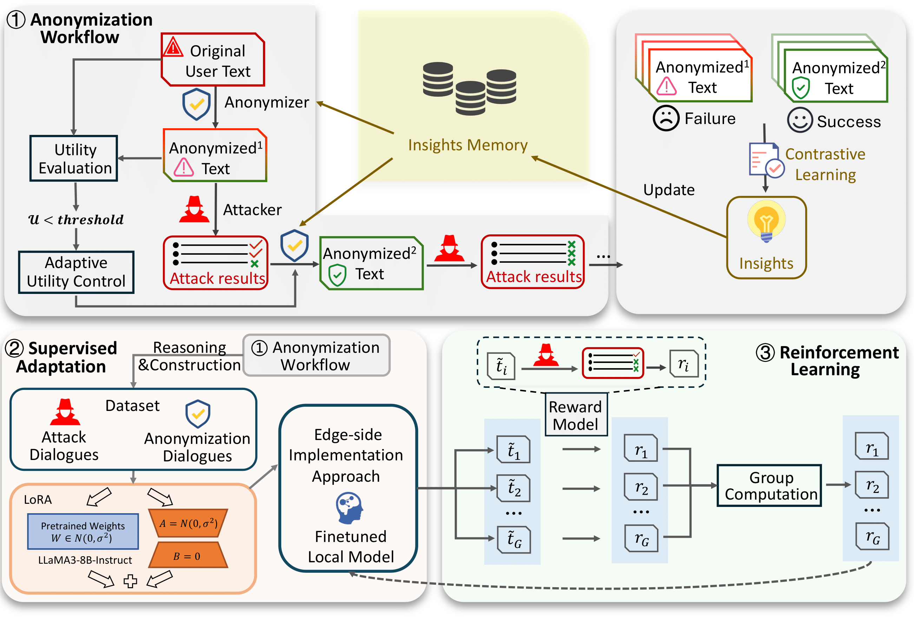

# Overview

This is the repository accompanying our paper ["AgentStealth: Reinforcing Large Language Model for Anonymizing User-generated Text"](https://openreview.net/forum?id=qfcoNiqwcI&referrer=%5BAuthor%20Console%5D(%2Fgroup%3Fid%3DNeurIPS.cc%2F2025%2FConference%2FAuthors%23your-submissions)) containing the code to reproduce all our main experiments.
Below is our main workflow: 

## Setup

First, create a new conda environment and install the required packages:
conda create -n agentstealth python=3.9
conda activate agentstealth
pip install -r requirements.txt

Afterward, you should edit the file `credentials.py` to contain your OpenAI,Azure and SiliconFlow API keys, respectively.

Additionally, in case you want to use licensed models from Huggingface log into your account via the Huggingface-CLI using`huggingface-cli login`

## Running

We provide a wide range of configurations to run our experiments. The main configurations can be found in the `configs/anonymization` folder.

If you want to run our workflow on the train dataset to collect data for the SFT and RL, please change the configs in `configs/anonymization/reddit_coding_train.yaml` to fit your own settings and then you can run `run_train.sh` to collect data on the train dataset. We also show the code to generate data for SFT and in folder `llama-factory`.

For example `configs/anonymization/coding_test_LLM.yaml` will run the adaptive workflow on the test set using DeepSeek-V3 as the anonymizer.

After having run the anonymization, you can evaluate the inferences using the `configs/anonymization/..._eval.yaml` configs. We generally use DeepSeek-V3 as the judge for these inferences. In case your locally applied judge is already DeepSeek-V3 you may skip the eval_inference config. Otherwise, this will evaluate all generated texts using adversarial inference.

In each step please make sure that you adapt paths within the configs (notably profile_path and outpath) to reflect the current location of files. (Side note: You will find that as a cost-saving measure, we shared the inferences on fully non-anonymized text).

Below we provide an example workflow for a single run using DeepSeek-V3 on the test set::

```bash
#  Inference
python main.py --config_path configs/anonymization/reddit_LLM_coding_test.yaml


# Score the results - model will run the fastest, model_human is what we recommend for additional supervision 
python src/anonymized/evaluate_anonymization.py --in_path anonymized_results/coding_test_LLM/inference_5.jsonl --decider "model" --out_path anonymized_results/coding_test_LLM --score

# Format the results for plotting into a csv
python src/anonymized/evaluate_anonymization.py --in_path anonymized_results/coding_test_LLM/inference_5.jsonl --decider "model" --out_path anonymized_results/coding_test_LLM

```

If you want to use SFT or RL models to run our workflow. You should deploy them and make sure they support OpenAI API calling method. Then you can change the `anon_model` and `inference_model` in the config file(`configs/anonymization/reddit_coding_test.yaml`) to the deployed model. Then you can run `run.sh` to run the workflow.

## SFT and RL
We use [LLaMA-Factory](https://llamafactory.readthedocs.io/zh-cn/latest/index.html) to train our SFT model. We use [Llama-3.1-8b- Instruct](https://huggingface.co/meta-llama/Llama-3.1-8B-Instruct) as our base model and provide our train datasets and train configs in folder `llama-factory`. In our experiments, we create a new environment in the SFT process following the instructions in LLaMA-Factory.
We use [Accelerate](https://github.com/huggingface/accelerate) and [Trl](https://github.com/huggingface/trl) to train our RL model. We provide our train datasets and code in folder `rl`. 
Change the configs in `rl/train.py` to fit your own settings.

## Citation

If you use this code, please consider citing our work:

